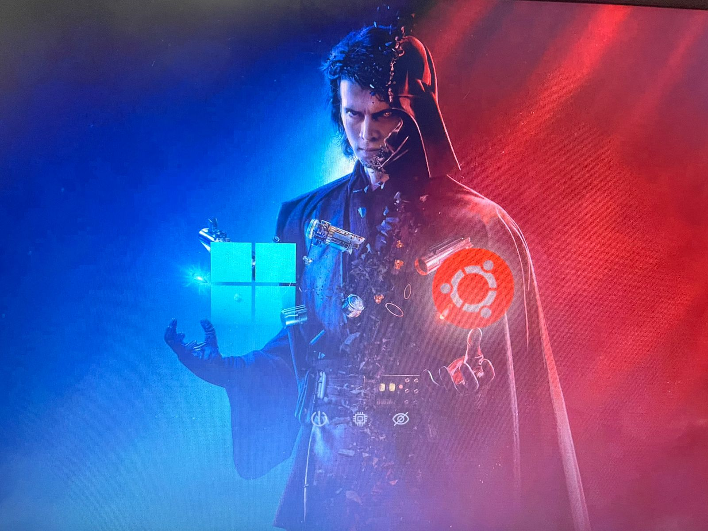

# 🌌 Star Wars (Anakin) Theme for rEFInd

A high-resolution theme for the **[rEFInd Boot Manager](https://rodsbooks.com/refind/)**, featuring Anakin Skywalker and a galactic aesthetic.



## 💻 Comprehensive Setup Guide

This section provides instructions for both installing rEFInd and applying this theme.

### Part 1: Installing the rEFInd Boot Manager (If needed)

Follow these steps on a Linux system (like Ubuntu) to install rEFInd.

1.  **Update and Install rEFInd:**
    ```bash
    sudo apt update
    sudo apt install refind
    ```
2.  **Run the Installation Script:**
    This command copies the necessary files to your EFI System Partition (ESP) and creates the NVRAM boot entry.
    ```bash
    sudo refind-install
    ```
3.  **Verify and Reboot:**
    Check your boot order to ensure rEFInd is the default. Then, reboot your system.

### Part 2: Applying the Star Wars Theme

After rEFInd is installed, you can apply the theme by moving the files into the correct location and updating the configuration.

#### 1. Locate the rEFInd EFI Directory

Identify the location of your rEFInd installation. This is typically mounted at:

* **Linux:** `/boot/efi/EFI/refind/`

We will refer to this path as `$REFIND_DIR`.

#### 2. Clone the Repository

Navigate to the `themes` directory inside your rEFInd installation and clone this repository.

```bash
cd $REFIND_DIR/themes
git clone [https://github.com/thilakshan2003/Starwars-rEFInd](https://github.com/thilakshan2003/Starwars-rEFInd)
